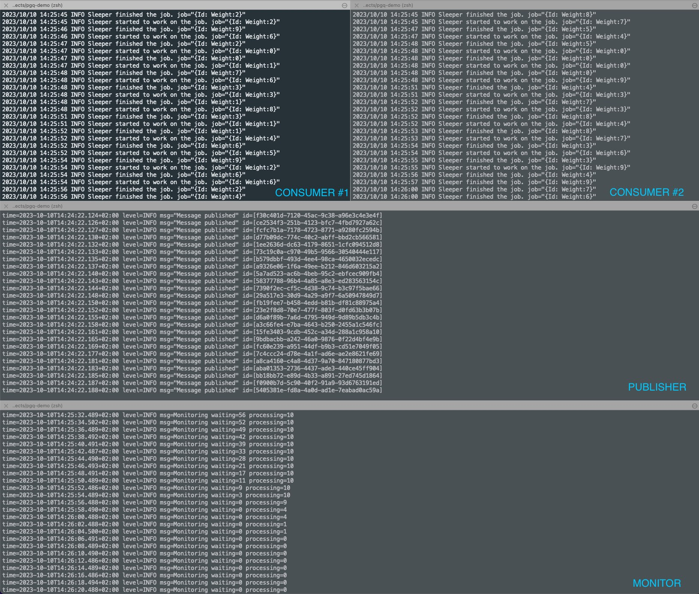
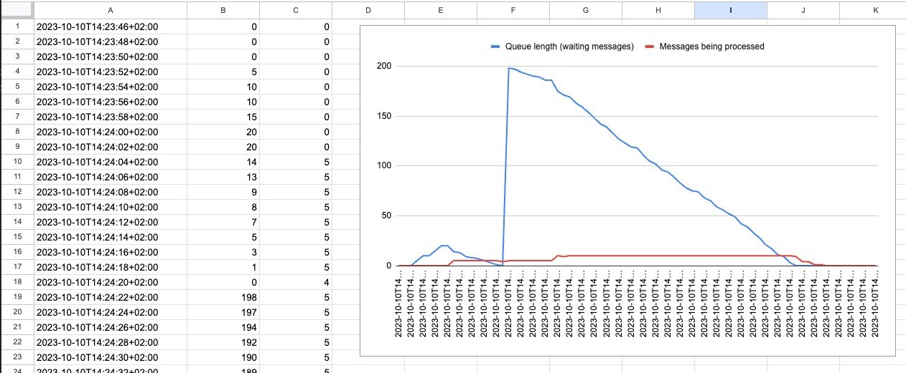

# PGQ demo app

## PGQ


The pgq is a very simple and lightweight queuing mechanism that is built on top of the postgres database.
Pgq is maintained by the Dataddo company which uses it in its production systems.

> https://go.dataddo.com/pgq

## Intro

This is a very simple set of pgq apps written in Go that allows you to: 
> - setup the pgq postgres queue.
> - create a consumer for the queue.
> - create a publisher/producer for the queue.

Please inspect the code for more details. You can use the `Makefile` to run the apps.

## Setup

Before running the apps, you need to set up the database. You can do this by running the following commands:
```bash
# Start postgres instance using docker, it will be accessible locally on port 5432
# Please see the POSTGRES_DSN variable in the Makefile. You can change it to point to your own postgres instance if you wish. 
$ make postgres

# Create the pgq queue table with expected pgq fields
# By default the table name is "demo_queue". You can change it in the Makefile. 
$ make setup
```

After running this query your consumers and publishers are ready to Go!

## Consuming

There are the `consumer/simple` and `consumer/advanced` apps in corresponding folders.
You may run them easily using Makefile commands. The simple consumers is executed with the pgq default values, 
whereas the advanced one shows you how to tune some consumer parameters.

The consumer just sleeps for the given time frame as instructed from the pgq message.
Please explore the code for more details.

```bash
# This command starts the consumer who waits for the messages in the queue and if there is some, it will consume it and loop again.
$ make consume-advanced
```

## Publishing

There is also a very naive publisher implementation which you can use for demo purposes.
It just publishes the given number of messages to the queue with random sleep time params read by consumers on consume.

```bash
# Publish some messages to the queue
$ make publish
```

## Monitoring

Without monitoring you are usually half blind. You may use the very naive monitoring app querying the queue table periodically.
It outputs the number of messages waiting in the queue and the number of messages currently being processed.

Hint: as the output file is a csv file, you may create a nice chart from it in google sheets/excel very easily.

```bash
# Gather and save the basic queue stats to the output file
$ make monitor
```

Here is the short list of of potentially helpful queries:
```sql
-- add the new message to the queue
insert into demo_queue (payload, metadata) values ('{"foo": "bar"}', '{}');

-- list all unprocessed messages
select * from demo_queue where processed_at is null;

-- list of currently bering processed messages
select * from demo_queue where locked_until is not null;

-- list all ended with error
select * from demo_queue where processed_at is not null and error_detail!='';

-- compute the average processing time
select avg((processed_at-started_at)) as avg_duration from demo_queue where processed_at is not null;

-- list all with sleep 9
select * from demo_queue where payload->'sleep' = '9';

```

## Summary

All in one you may run the following commands to see the demo full demo in action:
```bash
# setup and run monitoring
$ make setup
$ make monitor
# run consumer, optionally you may run multiple consumers in parallel
$ make consumer-advanced
# publish some messages, you may do it repeatedly of modify the count param in Makefile in publish target
$ make publish
```

The terminal may look like something like this:


The visualised queue stats may look like this:
